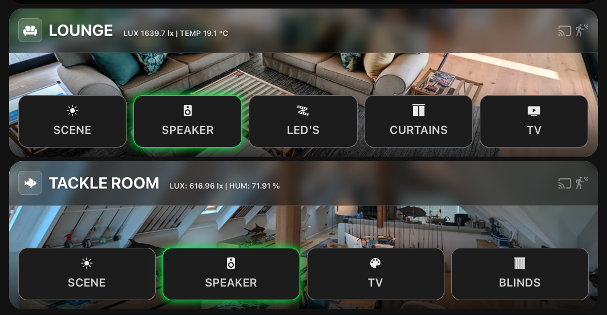
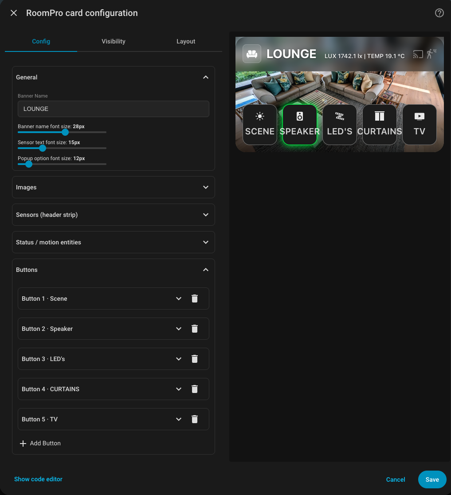

# RoomPro Card

A premium room control card for Home Assistant — a glassmorphism dashboard tile with a background image, a live sensor strip, status indicators, and a row of fully-themeable control buttons with in-card popups.

Configurable entirely from the visual editor (no YAML required).

## Mission & design philosophy

RoomPro Card is built for a **heavily-automated home** where day-to-day control should be rare. The house runs itself; the dashboard is a clean, glanceable **override panel** — not a busy control surface.

It is designed for:

- 🖥️ **Tablet displays in landscape** — wall-mounted or on a desk *(not phones/portrait)*
- 🧱 **Big, uniform buttons** in a single consistent style across every room
- 📐 **A predictable, fixed layout** — the same shape in every room so it's muscle-memory
- 🪧 **Full-screen panel mode** — no Home Assistant header, no sidebar, for an app-like kiosk view
- 🤖 **Minimal interaction** — automation does the work; the panel is for the occasional manual touch

> ⚠️ **Not designed for mobile / portrait viewing.** It targets landscape tablet dashboards in panel/kiosk mode.

For the intended look, put the cards in a **Panel** view and hide the header/sidebar (e.g. via [kiosk-mode](https://github.com/NemesisRE/kiosk-mode) or your tablet's fullscreen browser).

## Screenshots





## Features

- 🖼️ **Background image + glassmorphism** header with thumbnail or icon
- 📊 **Sensor strip** beside the room name (any entity — temperature, humidity, an `input_select` value, etc.)
- 🟢 **Status indicators** — one icon per entity (motion, media, locks, …), each coloured by its own state
- 🎛️ **Themeable buttons** — per-button background, edge, and a two-state glow (on/off colours, or no glow)
- 🪟 **In-card popups** for media, covers, locks, scenes and select options
- 🎚️ **Font-size controls** for the room name, sensor strip and popups
- 🧩 **Visual editor** with collapsible sections — every option is clickable

## Installation

### HACS (recommended)
1. HACS → **⋮** → **Custom repositories**
2. Add `https://github.com/paulbalinnel/roomcardpro`, category **Dashboard**
3. Find **RoomPro Card**, **Download**, then hard-refresh your browser
4. Edit a dashboard → **Add Card** → search **RoomPro Card**

### Manual
1. Copy `roompro-card.js` to `config/www/`
2. Settings → Dashboards → **⋮** → **Resources** → add `/local/roompro-card.js` as a **JavaScript Module**
3. Hard-refresh the browser

## Button action types

| Action | What it does |
| --- | --- |
| **Light** | Toggle a light |
| **Switch** | Toggle a switch |
| **Cover / blind** | Popup: open / stop / close |
| **Lock / door** | Popup: lock / unlock |
| **Media player** | Popup: power, volume up/down, mute |
| **Scene** | Popup of scene buttons |
| **Input select / select** | Popup of the entity's options (auto-filled) |
| **Power** | Run a script |
| **Navigate** | Open a dashboard/view via native navigation (no add-ons) |
| **Card popup** | Full-screen popup rendering any Lovelace card (`card:`) — no browser_mod/card-mod needed |
| **Custom service call** | Call any `domain.service` with optional YAML/JSON data |

Each button reflects its entity's live on/off state via the two-state glow.

## Configuration

### Card options
| Option | Description |
| --- | --- |
| `name` | Room name shown in the header |
| `background_image` | URL or `/local/...` path for the background |
| `thumbnail` | Small header image (falls back to the background) |
| `header_icon` | Icon shown in place of the thumbnail |
| `header_font_size` | Room-name font size (px) |
| `sensor_font_size` | Sensor-strip font size (px) |
| `popup_font_size` | Popup option/label font size (px) |
| `channel_font_size` | Media-popup channel name font size (px; `0` hides the name so the logo fills the tile) |
| `status_entities` | Header status icons. Each item is an entity id, or `{ entity, icon, color }` for a custom icon and on-colour |
| `sensors` | List of `{ entity, prefix, unit }` for the sensor strip |
| `sub_buttons` | Optional small pill buttons shown in a thin row above the main buttons (sub-switches / info chips) |
| `entities` | List of buttons (see below) |

### Button options
| Option | Description |
| --- | --- |
| `type` | Action type (see table above) |
| `entity` | Target entity (also drives the glow colour) |
| `name` | Button label |
| `icon` | MDI icon |
| `background_color` | Button background |
| `border_color` | Edge colour |
| `glow_color` | Glow when the entity is **on** (blank = no glow) |
| `glow_color_off` | Glow when the entity is **off** (blank = no glow) |
| `border_radius` | Corner radius (px) |
| `font_size` | Label font size (px) |
| `scenes` | (scene) list of `{ entity, name, icon }` |
| `options` | (select) optional list of `{ option, name, icon }` |
| `channels` | (media player) channel shortcuts `{ name, logo, service, service_data }` shown in the popup |
| `service` / `service_data` | (custom) `domain.service` and optional data |

## Example

```yaml
type: custom:roompro-card
name: Lounge
background_image: /local/lounge.jpg
header_font_size: 24
status_entities:
  - binary_sensor.lounge_motion
  - media_player.lounge_tv
sensors:
  - entity: sensor.lounge_temperature
    prefix: "Temp:"
    unit: "°C"
  - entity: sensor.lounge_lux
    prefix: "Lux:"
entities:
  - type: light
    entity: light.lounge_main
    name: Lights
    glow_color: "#facc15"
  - type: media_player
    entity: media_player.lounge_tv
    name: TV
  - type: cover
    entity: cover.lounge_curtains
    name: Curtains
  - type: custom
    name: Towel Rail
    icon: mdi:radiator
    entity: automation.towel_rail_heating
    service: automation.toggle
    glow_color: "#22c55e"
    glow_color_off: "#ef4444"
```

## License

This project is licensed under the Apache-2.0 License.
